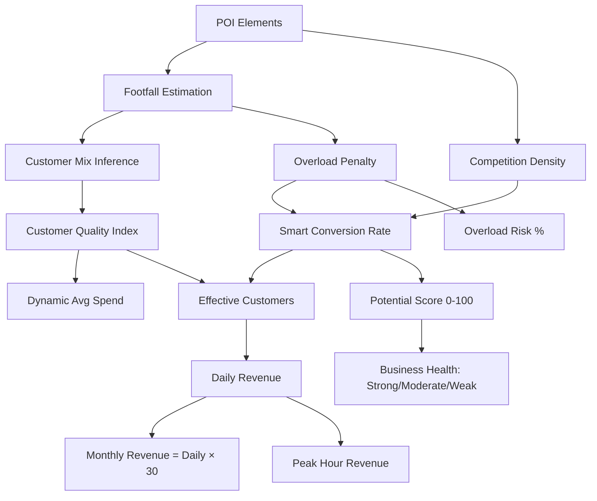

# Revenue Structure Report

**Project:** Crowd Heatmap & Business Intelligence Platform  
**Report Date:** June 30, 2026  
**Currency:** Indian Rupees (INR / ₹)  
**Primary Source:** `heatmap_app/utils.py`

---

## Executive Summary

This platform does **not** pull revenue from external financial databases. Instead, it uses a **simulation-based revenue engine** that estimates monthly, daily, and peak-hour revenue from:

- OpenStreetMap POI density (proxy for footfall)
- Business-type-specific metrics (average spend, conversion rate, capacity)
- Temporal multipliers (time of day)
- Customer Quality Index (spending power of the local crowd mix)
- Competition density and overload penalties

Three distinct revenue paths serve different UI flows. All outputs are **indicative forecasts** for business planning — not audited financial statements.

---

## 1. Revenue Architecture Overview

```text
                    ┌─────────────────────────────────┐
                    │     OpenStreetMap POI Data      │
                    │  (amenities, shops, tourism)    │
                    └───────────────┬─────────────────┘
                                    │
              ┌─────────────────────┼─────────────────────┐
              ▼                     ▼                     ▼
   ┌──────────────────┐  ┌──────────────────┐  ┌──────────────────┐
   │  Smart Revenue   │  │  POI Enrichment  │  │  Legacy Score    │
   │  Engine          │  │  Engine          │  │  (Crowd Score)   │
   │                  │  │                  │  │                  │
   │ calculate_smart_ │  │ enrich_places_   │  │ predict_revenue  │
   │ revenue()        │  │ with_revenue()   │  │ ()               │
   └────────┬─────────┘  └────────┬─────────┘  └────────┬─────────┘
            │                     │                     │
            ▼                     ▼                     ▼
   Dashboard, AI Zones,    Popular Places API,    Crowd Intensity
   /api/analyze-location/  total_area_revenue      analyze endpoint
```

| Engine | Entry Point | Primary Output |
|--------|-------------|----------------|
| Smart Revenue | `calculate_smart_revenue()` | Full revenue object with 12+ metrics |
| POI Enrichment | `enrich_places_with_revenue()` | Per-POI revenue + area total |
| Legacy Score | `predict_revenue(crowd_score)` | Single monthly estimate (0–100 score) |

---

## 2. Business-Type Revenue Parameters

All revenue calculations reference the `BUSINESS_METRICS` configuration in `heatmap_app/utils.py`.

| Business Type | Category | Avg Spend (₹) | Base Conversion | Optimal Crowd/hr | Overload Sensitivity |
|---------------|----------|---------------|-----------------|------------------|----------------------|
| Cafe | Hospitality | 350 | 18% | 20 – 60 | High |
| Restaurant | Dining | 1,200 | 10% | 40 – 100 | Medium |
| Fast Food | Dining | 500 | 25% | 50 – 150 | Low |
| Shop (Retail) | Retail | 2,000 | 8% | 10 – 50 | Medium |
| Supermarket | Retail | 1,800 | 35% | 50 – 200 | Low |
| Pharmacy | Healthcare | 800 | 40% | 10 – 40 | High |
| Default | General | 600 | 5% | 10 – 50 | Medium |

### Revenue Category Breakdown

```text
Hospitality (Cafe)          → Lower ticket, higher conversion sensitivity
Dining (Restaurant/Fast Food) → Higher ticket, wider capacity tolerance
Retail (Shop/Supermarket)   → Highest ticket, volume-driven conversion
Healthcare (Pharmacy)       → High conversion, low capacity, quick service
General (Default fallback)  → Conservative baseline for unknown types
```

---

## 3. Smart Revenue Engine (Primary)

**Function:** `calculate_smart_revenue(elements, business_type, hour=None)`  
**Used by:** `/api/analyze-location/`, AI Zone generation, Business Intelligence dashboard

### 3.1 Calculation Pipeline



### 3.2 Core Formulas

#### Footfall

```text
popularity_signal = min(1.5, POI_count / 60)
footfall = max(10, (22 + POI_count × 2.8) × (1 + popularity_signal × 0.35) × time_multiplier)
```

#### Smart Conversion Rate

```text
smart_conversion = base_conv × (1 − competition × 0.45) × rating_factor × overload_penalty × (1 − waiting_penalty)
smart_conversion = clamp(smart_conversion, 0.02, 0.60)
```

#### Revenue

```text
dynamic_avg_spend = avg_spend × (0.88 + 0.24 × customer_quality)
effective_customers = footfall × smart_conversion × customer_quality
daily_revenue = effective_customers × dynamic_avg_spend
monthly_revenue = daily_revenue × 30
peak_hour_revenue = (daily_revenue / 12) × peak_time_multiplier
```

### 3.3 Output Schema

| Field | Type | Description |
|-------|------|-------------|
| `daypart` | string | Morning / Lunch Spike / Afternoon / Evening Peak / Night Drop |
| `footfall` | float | Estimated hourly visitors |
| `conversion_rate` | float | Adjusted conversion (0.02–0.60) |
| `customer_quality` | float | CQI-weighted spending index |
| `dynamic_avg_spend` | float | ₹ per transaction (CQI-adjusted) |
| `effective_customers` | float | Paying customers per day |
| `daily_revenue` | float | ₹ per day |
| `estimated_monthly_revenue` | float | ₹ per month |
| `peak_hour_revenue` | float | ₹ during busiest hour |
| `overload_risk` | int | 0–100% capacity overflow risk |
| `potential_score` | int | 0–100 composite viability score |
| `business_health` | string | Strong / Moderate / Weak |
| `recommendations` | list | Up to 3 actionable strategy tips |

---

## 4. Customer Quality Index (CQI)

CQI adjusts both conversion and average spend based on inferred customer demographics from local POIs.

### Spending Power Multipliers

| Customer Segment | Multiplier | Rationale |
|------------------|------------|-----------|
| Student | 0.6× | Budget-conscious spending |
| Professional | 1.8× | High disposable income |
| Family | 1.3× | Medium-high household spend |
| Tourist | 2.5× | Premium discretionary spend |
| Resident | 1.0× | Baseline |

### Customer Mix Inference

The engine scans POI tags to infer segment proportions:

| POI Signal | Segment Boost |
|------------|---------------|
| school, college, university | Students (+2 each) |
| bank, office, restaurant, cafe | Professionals (+2 each) |
| supermarket, mall, clothes, department_store | Families (+2 each) |
| tourism tags | Tourists (+3 each) |
| park, cinema, hospital | Families (+1 each) |

Baseline mix is added (10% students, 16% professionals, 14% families, 8% tourists) so sparse data still produces reasonable estimates.

### Area-Type CQI (POI Enrichment Path)

| Inferred Area | Dominant Profile | CQI Multiplier |
|---------------|------------------|----------------|
| College | Student | 0.6× |
| Commercial | Professional | 1.8× |
| Market / Mall | Family | 1.3× |
| Tourism / Attraction | Tourist | 2.5× |
| Residential (default) | Resident | 1.0× |

---

## 5. Temporal Revenue Modifiers

Revenue varies by time of day through daypart multipliers.

### Smart Revenue Dayparts (`_daypart_multiplier`)

| Hour Range | Daypart | Multiplier |
|------------|---------|------------|
| 05:00 – 09:59 | Morning | 0.78× |
| 10:00 – 13:59 | Lunch Spike | 1.22× |
| 14:00 – 16:59 | Afternoon | 0.95× |
| 17:00 – 21:59 | Evening Peak | 1.35× |
| 22:00 – 04:59 | Night Drop | 0.58× |

### POI Enrichment Temporal Multipliers (`get_temporal_multiplier`)

| Hour Range | Period | Multiplier |
|------------|--------|------------|
| 00:00 – 05:59 | Late Night | 0.2× |
| 06:00 – 09:59 | Morning Rush | 0.8× |
| 11:00 – 13:59 | Lunch Peak | 1.4× |
| 14:00 – 16:59 | Afternoon Slump | 0.9× |
| 17:00 – 20:59 | Evening Peak | 1.6× |
| 21:00 – 23:59 | Late Evening | 1.1× |

**Impact:** The same location can show **2–3× revenue difference** between Night Drop and Evening Peak.

---

## 6. Competition & Overload Modifiers

### Competition Density

```text
competition = count(similar POIs) / total_POIs
competition capped at 1.0
conversion reduced by up to 45% at full saturation
```

### Overload Penalty

When footfall exceeds the business type's optimal capacity:

```text
excess_ratio = (footfall − optimal_max) / optimal_max
penalty = max(0.4, 1.0 − excess_ratio × sensitivity_factor)

sensitivity_factor = 0.5 (high) | 0.2 (medium/low)
```

### Waiting Penalty

```text
waiting_penalty = min(0.35, overload_ratio × 0.25)
```

**Business implication:** High-sensitivity types (cafe, pharmacy) lose revenue faster when overcrowded. Low-sensitivity types (fast food, supermarket) tolerate higher footfall.

---

## 7. Potential Score & Business Health

### Potential Score Weights

| Factor | Weight |
|--------|--------|
| Footfall potential | 24% |
| Low competition (inverse) | 22% |
| Customer quality | 20% |
| Low waiting penalty (inverse) | 18% |
| Rating factor | 16% |

### Health Classification

| Condition | Health Label |
|-----------|--------------|
| Score ≥ 78 AND overload risk &lt; 60% | **Strong** |
| Score ≥ 55 | **Moderate** |
| Score &lt; 55 | **Weak** |

---

## 8. POI Enrichment Engine (Secondary)

**Function:** `enrich_places_with_revenue(places)`  
**Used by:** `/find-popular-places/` endpoint

### Formula

```text
global_density_score = min(POI_count / 20, 3.0)
base_footfall = 50 × global_density_score
current_footfall = base_footfall × temporal_multiplier × random_fluctuation(±15%)
daily_revenue = current_footfall × (base_conv × CQI) × avg_spend
monthly_revenue = daily_revenue × 30
```

### Per-POI Output

| Field | Description |
|-------|-------------|
| `estimated_daily_revenue` | ₹ per day for this POI |
| `estimated_monthly_revenue` | ₹ per month for this POI |
| `peak_hour_revenue` | daily_revenue / 8 |
| `potential_score` | 0–100 based on footfall vs optimal range |
| `business_health` | Strong / Moderate / Weak |
| `overload_risk` | 0–100% |

### Area Total

The API returns `total_area_revenue` — the sum of all enriched POI monthly revenues, displayed on the map as aggregate area potential.

---

## 9. Legacy Revenue Score (Tertiary)

**Function:** `predict_revenue(crowd_score)`  
**Used by:** `/analyze-crowd-intensity/` quick estimate

```text
monthly_revenue = ₹1,20,000 + (crowd_score × ₹7,200)
```

| Crowd Score | Estimated Monthly Revenue |
|-------------|---------------------------|
| 0 | ₹1,20,000 |
| 25 | ₹3,00,000 |
| 50 | ₹4,80,000 |
| 75 | ₹6,60,000 |
| 100 | ₹8,40,000 |

**Note:** This is a simplified linear model for backward compatibility. The Smart Revenue Engine provides more accurate, business-type-aware forecasts.

---

## 10. AI Zone Revenue Integration

**Function:** `generate_best_location_candidates(base_lat, base_lon, elements, top_n=3)`

Each candidate zone (~1.7 km radius neighborhood) receives:

1. **Feasibility score** (0–100) from five weighted factors
2. **Recommended business type** based on local dynamics
3. **Smart revenue estimate** for that business at that offset

### Zone Scoring Weights

| Factor | Weight |
|--------|--------|
| Footfall potential | 30% |
| Inverse competition density | 22% |
| Spending power | 18% |
| Area growth (transport proximity) | 15% |
| Demand-supply gap | 15% |

### Business Recommendation Rules

| Condition | Recommended Business |
|-----------|---------------------|
| High spending power + low competition | Restaurant |
| High demand-supply gap + moderate footfall | Cafe |
| High competition density | Pharmacy |
| Default | Supermarket |

---

## 11. Illustrative Revenue Scenarios

The following scenarios are **computed from the engine formulas** with representative inputs. Actual values vary with live POI data and time of day.

### Scenario A: Medium-Density Commercial Area (50 POIs, Evening Peak)

Assumptions: 50 POIs, hour = 18 (Evening Peak), professional-heavy mix (CQI ≈ 1.7).

| Business Type | Est. Daily Revenue | Est. Monthly Revenue | Potential Score | Health |
|---------------|-------------------|---------------------|-----------------|--------|
| Cafe | ~₹11,000 | ~₹3,30,000 | 45–55 | Moderate |
| Restaurant | ~₹18,000 | ~₹5,40,000 | 50–60 | Moderate |
| Fast Food | ~₹22,000 | ~₹6,60,000 | 55–65 | Moderate |
| Supermarket | ~₹45,000 | ~₹13,50,000 | 60–70 | Moderate–Strong |
| Pharmacy | ~₹15,000 | ~₹4,50,000 | 50–60 | Moderate |
| Retail Shop | ~₹8,000 | ~₹2,40,000 | 40–50 | Moderate |

*Note: Overload penalties significantly reduce cafe/pharmacy revenue in high-density areas.*

### Scenario B: Same Area, Different Dayparts (Cafe, 50 POIs)

| Daypart | Time Multiplier | Relative Monthly Revenue |
|---------|-----------------|--------------------------|
| Morning | 0.78× | ~₹1,90,000 |
| Lunch Spike | 1.22× | ~₹3,00,000 |
| Evening Peak | 1.35× | ~₹3,30,000 |
| Night Drop | 0.58× | ~₹1,40,000 |

### Scenario C: POI Density Impact (Cafe, Evening Peak)

| POI Count | Footfall (approx.) | Relative Revenue |
|-----------|-------------------|------------------|
| 10 (Low) | ~65 | ~₹45,000/mo |
| 35 (Medium) | ~210 | ~₹2,00,000/mo |
| 70 (High) | ~395 | ~₹2,80,000/mo* |
| 100 (Very High) | ~560 | ~₹2,50,000/mo* |

*\*Revenue plateaus or declines at very high density due to overload penalties on high-sensitivity business types.*

---

## 12. Revenue Flow in the Application

```text
User selects location on map
        │
        ├── "Find Popular Places"
        │       └── enrich_places_with_revenue()
        │               └── total_area_revenue displayed on map
        │
        ├── "Analyze Crowd Intensity"
        │       └── predict_revenue(crowd_score)
        │               └── quick monthly estimate in heatmap panel
        │
        ├── Dashboard → "Analyze Location"
        │       └── calculate_smart_revenue()
        │               └── full BI panel: daily, monthly, peak, health, recommendations
        │
        └── "Generate AI Zones"
                └── generate_best_location_candidates()
                        └── per-zone estimated_revenue + feasibility score
```

### Frontend Display (INR Formatting)

All revenue values are formatted using `Intl.NumberFormat('en-IN', { currency: 'INR' })` in `static/js/main.js`, with live animation via `animateNumberTo()`.

---

## 13. Automated Recommendations Engine

Based on computed metrics, the system generates up to 3 strategic recommendations:

| Trigger | Recommendation |
|---------|----------------|
| Overload risk ≥ 70% | Add queue automation and split peak-hour staffing |
| Overload risk 40–69% | Introduce time-slot discounts to flatten spikes |
| Overload risk &lt; 40% | Scale marketing during lunch/evening to capture unused capacity |
| Conversion &lt; 8% | Improve storefront visibility and local ad targeting |
| Conversion ≥ 8% | Prioritize upsell bundles to lift average spend |
| CQI &lt; 1.1 | Offer value packs and loyalty rewards |
| CQI &gt; 1.6 | Premium positioning can materially increase revenue |

---

## 14. Feasibility ↔ Revenue Integration

Revenue forecasts and feasibility checks share the same POI data but serve different decisions:

| System | Question Answered | Key Output |
|--------|-------------------|------------|
| Feasibility (`check_feasibility`) | Should I open this business here? | Go / No-Go + dominant intensity |
| Smart Revenue (`calculate_smart_revenue`) | How much could I earn? | Monthly/daily/peak revenue |
| AI Zones (`generate_best_location_candidates`) | Where nearby is better? | Ranked locations with revenue |

Feasibility uses three proof layers:
1. **CSV intensity mapping** — business type allowed for crowd level
2. **ML primary recommendation** — DecisionTreeClassifier prediction
3. **Live POI evidence** — ≥ 2 similar businesses already operating nearby

---

## 15. Limitations & Assumptions

| Limitation | Impact |
|------------|--------|
| No real transaction data | All figures are simulated estimates |
| OSM POI coverage varies | Rural/sparse areas may under-report density |
| Static business metrics | Avg spend and conversion are hardcoded, not market-calibrated |
| Random fluctuation (±15%) | POI enrichment path adds noise for "live" feel |
| 2 km analysis radius | May miss broader market dynamics |
| India-focused geocoding | Location search bounded to India viewbox |
| Time-of-day only | No day-of-week or seasonal modifiers |

**Recommendation:** Use revenue outputs for **comparative analysis** (Location A vs B, Cafe vs Restaurant) rather than as guaranteed financial projections.

---

## 16. Configuration Reference

All tunable revenue parameters live in `heatmap_app/utils.py`:

| Config Block | Purpose |
|--------------|---------|
| `BUSINESS_METRICS` | Per-type spend, conversion, capacity, sensitivity |
| `CQI_MULTIPLIERS` | Customer segment spending weights |
| `get_temporal_multiplier()` | POI enrichment time modifiers |
| `_daypart_multiplier()` | Smart revenue time modifiers |
| `get_overload_penalty()` | Capacity overflow revenue loss |
| `_location_factor_components()` | AI Zone scoring inputs |

To adjust revenue behavior, modify these constants and restart the server. No database migration is required.

---

## 17. Summary

| Revenue Layer | Monthly Range (Typical) | Best For |
|---------------|------------------------|----------|
| Legacy Score | ₹1.2L – ₹8.4L | Quick crowd-based estimate |
| POI Enrichment | Per-POI ₹50K – ₹5L+ | Existing business landscape |
| Smart Revenue | ₹1L – ₹15L+ (type-dependent) | Business planning dashboard |

The revenue structure is **multi-layered, business-type-aware, and dynamically modulated** by time, competition, customer quality, and capacity constraints — designed to give entrepreneurs actionable financial context alongside geographic crowd intelligence.

---

*Report generated from static analysis of the Crowd Heatmap & Business Intelligence Platform codebase.*
